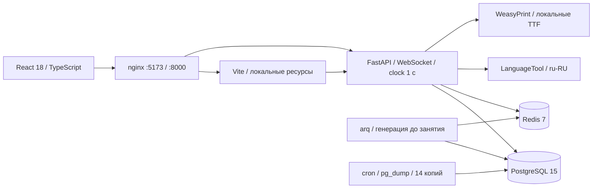
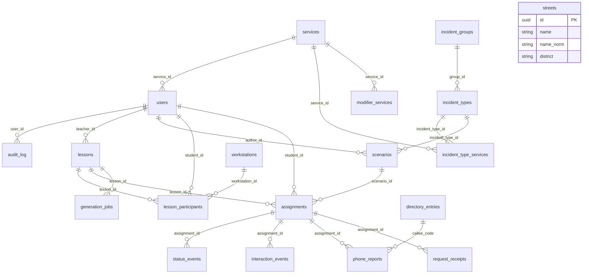

# Архитектура

Один локальный сервер обслуживает браузеры учебного класса. FastAPI работает одним процессом: WebSocket-комнаты находятся в памяти, горизонтальное масштабирование не входит в MVP. Источник времени и оценок — сервер. PostgreSQL хранит бизнес-данные; Redis — очередь arq, ограничения входа, отзыв сессий и пересылку прогресса worker.

Прикладные контейнеры подключены к Docker-сети `local` с `internal: true`. Только nginx имеет сеть входа и публикует порты; по умолчанию они привязаны к 127.0.0.1. Во время работы браузер обращается к своему серверу; CDN, облачных API и загрузок моделей нет.

## Потоки данных

- Преподаватель создаёт занятие, назначает утверждённые сценарии или запускает фоновую генерацию. Адреса, типы, службы и эталон вычисляются из справочников; генератор пишет только описание. Автопроверка предшествует ручному утверждению.
- Планировщик раз в секунду выдаёт QUEUED с учётом интервала и лимита карточек, создаёт ADDED, фиксирует просрочки и отправляет сообщения после commit. HEARTBEAT идёт раз в 5 с. Клиент пересинхронизируется серверным временем; часы компьютера не участвуют в оценке.
- Первое открытие фиксирует opened_at и RECEIVED. Чистый `domain/status_machine.py` проверяет переход и обязательный комментарий. Транзакция сохраняет статус, взаимодействие, аудит и ответ идемпотентности. Окончательный статус закрывает карточку и сохраняет оценку.
- Адресная проверка использует нормализацию, пары похожих улиц и pg_trgm. LanguageTool имеет таймаут 1,5 с; при отказе грамотность исключается, веса перераспределяются. Чистый движок получает готовый снимок и не вызывает модель или часы.
- Доклад сохраняется в phone_reports и учитывается в completeness. Аудио — готовые WAV. Offline-очередь привязана к пользователю и сохраняет Idempotency-Key; сервер хранит ответ 10 минут.
- Преподаватель получает свои занятия. Наблюдение не открывает карточку от имени студента. Корректировка хранится отдельно от score, с причиной и аудитом; отчёт показывает действующий итог и отметку исправления.

## База данных

17 канонических таблиц и две технические: `request_receipts` для атомарной идемпотентности, `generation_jobs` для состояния и восстановления фоновой генерации. Схемой управляет Alembic; pg_trgm устанавливается миграцией. Ручного SQL в прикладном рантайме нет.

`directory_entries.code → phone_reports.callee_code` — логическая связь; доклад сохраняет набранный номер. JSONB `card_payload`, `reference`, `settings`, `score`, `teacher_override` соответствуют SPEC. Индексы покрывают задания, события, аудит и trigram-поиск. Триггер PostgreSQL запрещает UPDATE/DELETE `audit_log`; история хранится бессрочно.

Студенческие изменения берут совместимую блокировку занятия и исключительную блокировку своей карточки. Завершение занятия и планировщик берут исключительную блокировку занятия; порядок «занятие → карточка» предотвращает гонку завершения с действием. Разные студенты не блокируют друг друга. Пул сервера — 50 соединений и до 10 дополнительных, с учётом одновременных HTTP-запросов и проверок WebSocket. HTTP-клиент LanguageTool и Redis создаются на время работы приложения и переиспользуют соединения. Nginx сохраняет HTTP-соединения с backend; адрес контейнера обновляется через Docker DNS.

Планировщик выдаёт карточки пакетом в одной транзакции; списки получают метаданные и последний статус общими запросами. Пульт читает последнее действие каждого участника через DISTINCT ON. Повторные одновременные проверки одного текста используют один выполняющийся запрос LanguageTool; завершённый результат в Python не кэшируется. Собственный штатный кэш LanguageTool хранится только внутри сервиса, поэтому его остановка обнаруживается новым запросом.

При старте `gc.collect(); gc.freeze()` переводит долгоживущий граф импортированных схем/шрифтов в постоянное поколение; сборка объектов последующих запросов продолжает работать. Это устраняет измеренные паузы полного GC 58–66 мс; при остановке выполняется `gc.unfreeze()`. Сервер по-прежнему использует один процесс uvicorn с uvloop, комнаты WebSocket локальны этому процессу.

## Безопасность и наблюдаемость

Argon2id; JWT в HttpOnly/SameSite=Strict cookie на 8 часов; все изменения требуют CSRF. Ограничение входа — 5 попыток/15 минут на логин. TOTP запрещает повтор кода. Сброс пароля и блокировка отзывают сессии; WebSocket повторно проверяет срок, активность и роль.

Каждый ответ содержит X-Request-ID. JSON-логи: ts, level, request_id, user_id, route, duration_ms. `/healthz` проверяет процесс; `/admin/health` — компоненты и последнюю копию; `/metrics` — Prometheus-метрики без персональных данных.

Доказательства: все 90 пар автомата статусов; 100 одинаковых прогонов оценки; PostgreSQL/Redis/LanguageTool-тесты; Chromium-сценарии; восстановление backup; нагрузочная приёмка. Итоговые результаты — PROGRESS.md.
